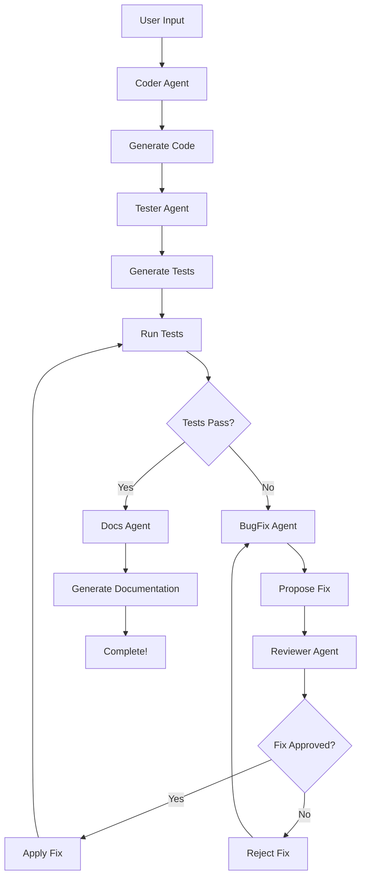

# 🤖 DevFlow.AI - Multi-Agent AI Developer

DevFlow.AI is a **multi-agent AI system** that automates the entire software development workflow. It simulates a collaborative development environment where specialized AI agents work together to generate code, write tests, fix bugs, review changes, and create documentation.

Built with **Streamlit**, **CrewAI**, and **Groq's Llama-3.1**, DevFlow.AI provides a zero-cost, cloud-deployable solution for AI-assisted development.

---

## ✨ Key Features

### 🚀 **Dual Development Modes**

1. **New Feature Mode** - Generate a complete project from scratch based on a feature description
2. **Real-World Project Mode** - Upload an existing project (zip) and request improvements or new features

### 🤝 **Specialized AI Agents**

- **Coder Agent** - Generates production-ready code based on requirements
- **Tester Agent** - Creates comprehensive test suites (pytest-compatible)
- **BugFix Agent** - Automatically identifies and fixes failing tests
- **Reviewer Agent** - Reviews proposed bug fixes and approves/rejects changes
- **Docs Agent** - Generates comprehensive project documentation

### 🔄 **Intelligent Test-Fix Loop**

DevFlow.AI features an **automated debugging workflow** with agent collaboration:
1. Tests are generated and executed automatically
2. If tests fail, BugFix Agent proposes a solution
3. Reviewer Agent evaluates the fix (approval/rejection)
4. Only approved fixes are applied to the codebase
5. Process repeats up to 3 attempts until tests pass

### 📦 **Project Management**

- **Automatic Project Organization** - Each project gets its own folder with `code.py`, `tests.py`, and `docs.md`
- **Project History** - View and browse all previously generated projects
- **Code Context Awareness** - Upload existing codebases for context-aware improvements

### 🎨 **Modern UI**

- Clean, dark-themed Streamlit interface
- Progressive updates during pipeline execution
- Syntax-highlighted code display
- Collapsible project sections

---

## 🛠️ Installation

### 1. Clone the Repository

```bash
git clone https://github.com/keshav2862/DevFlow.AI
cd DevFlow.AI
```

### 2. Create Virtual Environment

```bash
python -m venv venv

# On Windows
venv\Scripts\activate

# On macOS/Linux
source venv/bin/activate
```

### 3. Install Dependencies

```bash
pip install -r requirements.txt
```

### 4. Set Up Environment Variables

Create a `.env` file in the project root:

```env
GROQ_API_KEY=your_groq_api_key_here
OPENAI_API_KEY=your_openai_api_key_here  # Optional, for OpenAI models
```

> **Get a free Groq API key:** [https://console.groq.com](https://console.groq.com)

---

## ▶️ Usage

### Running the App

```bash
streamlit run app.py
```

The app will open in your browser at `http://localhost:8501`

### Creating a New Project

1. Enter your feature request in the sidebar text area
2. Click **"🚀 Run Pipeline"**
3. Watch as agents collaborate to build your project
4. View outputs in the `projects/` folder

**Example:**
```
Feature Request: "Build a calculator with basic operations (add, subtract, multiply, divide)"
```

### Improving an Existing Project

1. Zip your existing project folder
2. Upload the `.zip` file using the file uploader
3. Describe the improvements or new features you want
4. Click **"🚀 Run Pipeline"**
5. DevFlow.AI will analyze your code and implement the changes

---

## 📁 Project Structure

```
DevFlow.AI/
├── agents/                  # Agent implementations
│   ├── coder_agent.py      # Code generation agent
│   ├── tester_agent.py     # Test generation agent
│   ├── bugfix_agent.py     # Bug fixing agent
│   ├── reviewer_agent.py   # Code review agent
│   └── docs_agent.py       # Documentation agent
├── projects/               # Generated projects (auto-created)
│   └── [project_name]/
│       ├── code.py        # Generated code
│       ├── tests.py       # Generated tests
│       └── docs.md        # Documentation
├── .streamlit/            # Streamlit configuration
│   └── config.toml       # Custom theme
├── app.py                # Main application
├── requirements.txt      # Python dependencies
├── .env                  # Environment variables (create this)
├── .gitignore           # Git ignore rules
└── readme.md            # This file
```

---

## 🧪 Testing

Each generated project includes a `tests.py` file compatible with pytest.

### Run Tests for a Specific Project

```bash
cd projects/[project_name]
pytest tests.py
```

### Run All Tests

```bash
pytest projects/*/tests.py
```

---

## 🚢 Deployment

### Deploy to Streamlit Community Cloud (FREE)

1. Push your code to GitHub
2. Go to [share.streamlit.io](https://share.streamlit.io)
3. Connect your GitHub repository
4. Add your `GROQ_API_KEY` in the Secrets section:
   ```toml
   GROQ_API_KEY = "your_key_here"
   ```
5. Deploy!

### Environment Variables for Deployment

In Streamlit Cloud, add these secrets:
- `GROQ_API_KEY` - Your Groq API key (required)
- `OPENAI_API_KEY` - OpenAI API key (optional)

---

## 🔧 Technologies

- **Python 3.8+**
- **Streamlit** - Web interface
- **CrewAI** - Multi-agent orchestration framework
- **Groq** - Fast LLM inference (Llama-3.1-8B)
- **LangChain** - LLM tooling and utilities
- **ChromaDB** - Vector database for context
- **pytest** - Testing framework

---

## 🎯 Workflow Pipeline



---

## 📌 Roadmap

- [x] Multi-agent workflow with collaborative debugging
- [x] Real-world project improvement mode
- [x] Automated test-fix loop with reviewer approval
- [ ] Support for more programming languages (JavaScript, Go, Rust)
- [ ] Integration with CI/CD pipelines
- [ ] Database schema generation agent
- [ ] Infrastructure/DevOps agent
- [ ] Multi-file project support
- [ ] Code refactoring agent
- [ ] Security audit agent

---

## 🤝 Contributing

Contributions are welcome! Please feel free to submit a Pull Request.

1. Fork the repository
2. Create your feature branch (`git checkout -b feature/AmazingFeature`)
3. Commit your changes (`git commit -m 'Add some AmazingFeature'`)
4. Push to the branch (`git push origin feature/AmazingFeature`)
5. Open a Pull Request

---

## 📄 License

This project is licensed under the MIT License - see the [LICENSE](LICENSE) file for details.

---

## 🙏 Acknowledgments

- **CrewAI** - For the amazing multi-agent framework
- **Groq** - For fast, free LLM inference
- **Streamlit** - For making web apps incredibly simple

---

## 📧 Contact

**Keshav** - [@keshav2862](https://github.com/keshav2862)

**Project Link:** [https://github.com/keshav2862/DevFlow.AI](https://github.com/keshav2862/DevFlow.AI)

---

**⭐ If you find this project useful, please give it a star!**
